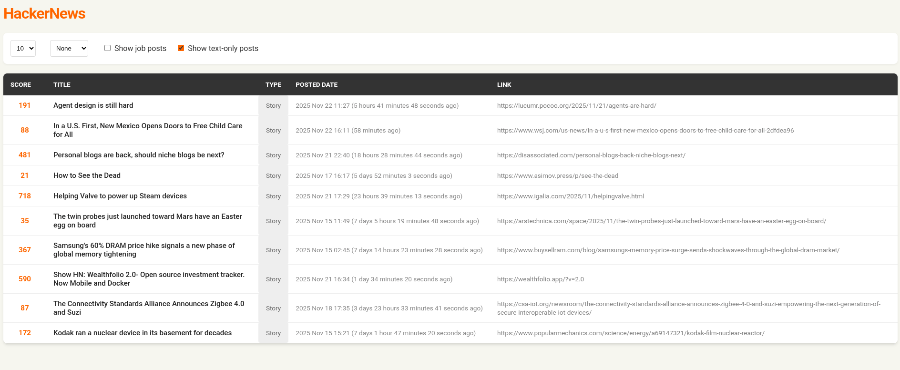

# Elm Project for school (**HackerNews Feed**)

**Why not check it out?** --> [web demo 👈](https://afraisnotavailable.github.io/Elm-Project/)

It's a simple **static application** that fetches the last 50 posts from **HackerNews** and applies some **filters** to them.

...The catch is that it's fully written in **Elm** :)